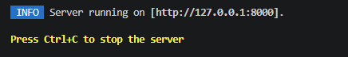

# Certamen_Laravel
Comandos ejecutados para la instalacion del servidor 
composer create-project laravel/laravel Certamen_laravel
 




## Rutas de la Aplicación (routes/web.php)

| Método | URL | Nombre Ruta | Controlador | Descripción |
|--------|-----|------------|-------------|-------------|
| GET | `/` | - | welcome | Página de bienvenida |
| GET | `/recetas` | `recetas.index` | `RecetaController@index` | Listado de recetas con filtros |
| GET | `/recetas/create` | `recetas.create` | `RecetaController@create` | Formulario para crear receta |
| POST | `/recetas` | `recetas.store` | `RecetaController@store` | Guarda nueva receta en sesión |
| GET | `/recetas/{id}` | `recetas.show` | `RecetaController@show` | Detalle de una receta específica |
| GET | `/buscar` | `recetas.buscar` | `RecetaController@buscar` | Búsqueda avanzada de recetas |

##  Búsqueda y Filtrado Combinado

### Descripción General
El método `buscar()` del controlador permite combinar:
- **Filtro de texto**: Busca por nombre o descripción de la receta
- **Filtro por tipo**: Entrada, Plato Principal, Postre
- **Aplicación simultánea** de múltiples criterios

### Fragmento de Código - Método `buscar()`

```php
public function buscar(Request $request)
{
    // Obtener recetas de sesión o usar las predefinidas
    $recetas = session('recetas', $this->recetas);
    
    // Obtener parámetro de búsqueda y convertir a minúsculas
    $query = strtolower($request->buscar ?? '');
    
    // Si no hay búsqueda, redirigir al índice
    if ($query === '') {
        return redirect()->route('recetas.index');
    }
    
    // Filtro de búsqueda por nombre O descripción
    $resultados = array_filter($recetas, function($receta) use ($query) {
        return strpos(strtolower($receta['nombre']), $query) !== false ||
               strpos(strtolower($receta['descripcion']), $query) !== false;
    });
    
    // Reindexar array después del filtro
    $resultados = array_values($resultados);
    
    // Preparar opciones para filtros adicionales
    $tipos = ['Entrada', 'Plato Principal', 'Postre'];
    $dificultades = ['Fácil', 'Media', 'Difícil'];
    
    // Pasar resultados a la vista
    return view('recetas.buscar')->with(compact('resultados', 'query', 'tipos', 'dificultades'));
}


```php
$query = strtolower($request->buscar ?? '');
```
- `$request->buscar` obtiene el parámetro desde el URL (ej: `?buscar=empanada`)
- `strtolower()` convierte a minúsculas para búsqueda sin sensibilidad a mayúsculas
- `??` es el operador "null coalesce" - si no existe, usa cadena vacía

#### 2. Validación
```php
if ($query === '') {
    return redirect()->route('recetas.index');
}

### Ejemplos Reales del Proyecto

#### Ejemplo 1: Buscar "empanada"
```
URL: /buscar?buscar=empanada
```
Encuentra: **Empanadas de Pino** (Entrada)
- Coincide en nombre: "**empanada**s de Pino"

### Fragmento de Código - Vista `show.blade.php`

```blade
<!-- Pasos de Preparación -->
@if(!empty($receta['pasos']))
    <section class="mb-10">
        <h2 class="text-2xl font-bold text-gray-800 mb-6 border-b-2 border-blue-600 pb-3">
            Pasos de Preparación
        </h2>
        <div class="space-y-4">
            @foreach($receta['pasos'] as $index => $paso)
                <div class="flex gap-6 p-6 bg-blue-50 rounded-lg border-l-4 border-blue-500">
                    <!-- Numeración automática con $loop->iteration -->
                    <div class="flex-shrink-0 w-12 h-12 bg-blue-500 text-white rounded-full flex items-center justify-center font-bold text-lg">
                        {{ $loop->iteration }}
                    </div>
                    <p class="text-gray-800 font-medium pt-2">
                        {{ $paso }}
                    </p>
                </div>
            @endforeach
        </div>
    </section>
@endif
```

# Herencia de Vistas Blade, @yield y redirect()->with()


### Ejemplo: Herencia en index.blade.php
```blade
@extends('layouts.app')

@section('title', 'Mis Recetas - RecetasChilenas')

@section('content')
    <div class="container mx-auto px-4 py-8">
        <h1 class="text-4xl font-bold text-gray-800 mb-2">Mis Recetas</h1>
        <!-- Contenido específico de index -->
    </div>
@endsection

### Ejemplo: Vista index.blade.php
```blade
@extends('layouts.app')

@section('title', 'Mis Recetas - RecetasChilenas')

@section('content')
    <div class="container mx-auto px-4 py-8">
        <!-- Header -->
        <div class="text-center mb-10">
            <h1 class="text-4xl font-bold text-gray-800 mb-2">Mis Recetas</h1>
            <p class="text-gray-600 text-lg">Explora y gestiona tus recetas favoritas</p>
        </div>

        <!-- Panel de Filtros -->
        <div class="bg-white rounded-xl shadow-lg p-6 mb-8">
            <h2 class="text-xl font-bold text-gray-800 mb-4">Filtros</h2>
            <form action="{{ route('recetas.index') }}" method="GET">
                <!-- Filtros -->
            </form>
        </div>

        <!-- Grid de recetas -->
        <div class="grid grid-cols-1 md:grid-cols-2 lg:grid-cols-3 gap-6">
            @forelse($recetas as $receta)
                <div class="bg-white rounded-xl shadow-lg overflow-hidden hover:shadow-2xl transition">
                    <a href="{{ route('recetas.show', ['id' => $receta['id']]) }}">
                        
                        <div class="p-6">
                            <h3 class="text-xl font-bold text-gray-800">{{ $receta['nombre'] }}</h3>
                            <p class="text-gray-600">{{ $receta['tipo'] }} - {{ $receta['tiempo'] }} min</p>
                        </div>
                    </a>
                </div>
            @empty
                <p class="text-gray-600">No hay recetas</p>
            @endforelse
        </div>
    </div>
@endsection
```

---

## redirect()->with() - Mensajes de sesión

### Casos de uso

#### 1. Redirigir después de crear (método store)
```php
public function store(Request $request)
{
    // Obtener recetas de la sesión
    $recetas = session('recetas', $this->recetas);
    
    // Calcular el próximo ID
    $maxId = collect($recetas)->max('id') ?? 0;
    $nuevoId = $maxId + 1;
    
    // Crear nueva receta
    $nuevaReceta = [
        'id' => $nuevoId,
        'nombre' => $request->nombre,
        'tipo' => $request->tipo,
        'dificultad' => $request->dificultad,
        'descripcion' => $request->descripcion,
        'tiempo' => $request->tiempo,
        'ingredientes' => array_filter(
            explode(',', $request->ingredientes), 
            fn($i) => trim($i) !== ''
        ),
        'pasos' => array_filter(
            explode('|', $request->pasos ?? ''), 
            fn($p) => trim($p) !== ''
        ),
        'imagen_url' => $request->imagen_url ?? 'https://via.placeholder.com/500x400?text=Receta'
    ];
    
    // Agregar a la lista y guardar en sesión
    $recetas[] = $nuevaReceta;
    session(['recetas' => $recetas]);
    
    // Redirigir a show con mensaje de éxito
    return redirect()->route('recetas.show', ['id' => $nuevoId])
        ->with('success', 'Receta creada correctamente!');
    //                  ↑ Mensaje guardado en sesión
}
```